<div align="center">

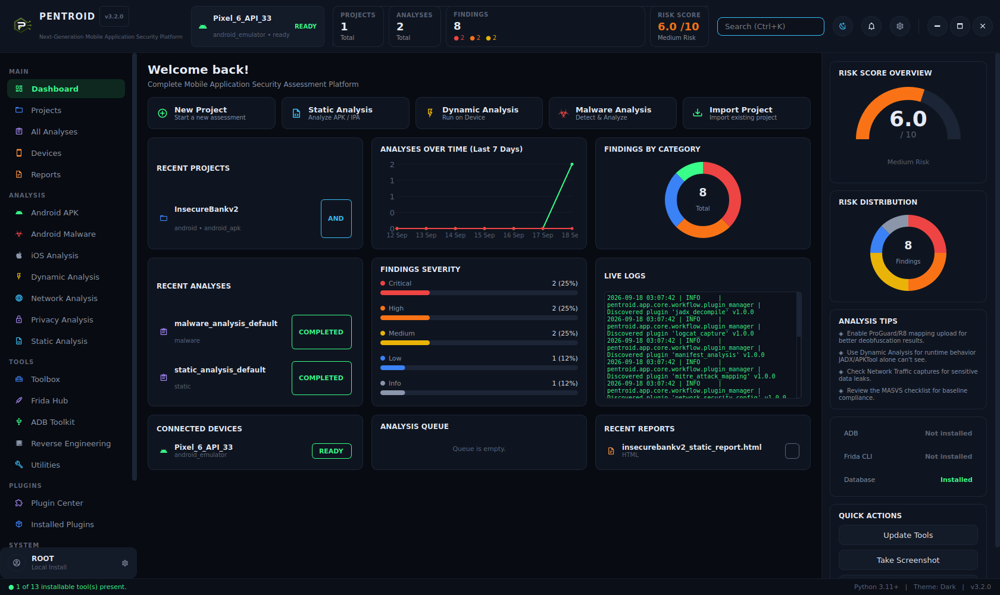

# Pentroid

**A desktop mobile application security platform that actually runs the tools it
orchestrates — APKTool, JADX, YARA, Quark-Engine, APKiD, Frida, ADB — instead of
reimplementing them badly.**


[Features](#key-features) •
[How It Works](#how-it-works) •
[Installation](#installation) •
[Usage](#usage) •
[Screenshots](#screenshot-gallery) •
[Roadmap](#roadmap)

</div>

---

<div align="center">
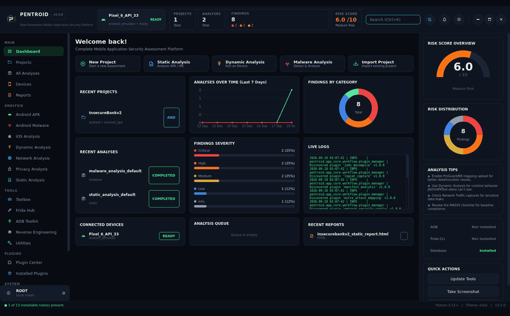

<sub>Real captures of the running app — dashboard → static analysis pipeline → findings triage → plugin catalog → Frida device control → network setup.</sub>
</div>

---

## Overview

Pentroid is a PySide6 desktop application for Android (and, partially, iOS) mobile
application security assessment — static analysis, malware triage, dynamic
instrumentation, and device management, in one tool, with no server or Docker
container required.

What it isn't: a reimplementation of APKTool's decompiler or JADX's disassembler in
Python. Pentroid's job is orchestration — it drives the real, well-established tools
the mobile security community already trusts (APKTool, JADX, YARA, Quark-Engine,
APKiD, VirusTotal, Frida, ADB), aggregates what they find into one consistent
finding schema, tracks it in a real database, and gets out of the way. Every install
is a real download of the real upstream project, checksum-verified; every scan step
either genuinely ran or is reported as skipped, with a reason — never silently.

Built for security researchers and bug hunters who want a fast, transparent,
locally-run alternative to spinning up a server-based scanner for a single APK.

---

## Key Features

**Detection — 19 plugins across 5 workflows**
- Static analysis: manifest, permissions, exported components, hardcoded secrets
  (format-matched *and* entropy-based), insecure crypto patterns, cleartext traffic,
  TLS bypass detection, network security config, embedded tracker/SDK fingerprinting
- Malware triage: file hashing, VirusTotal reputation, YARA rule matching, APKiD
  packer/obfuscator fingerprinting, Quark-Engine behavior scoring, IOC extraction,
  MITRE ATT&CK technique mapping
- Dynamic analysis: real on-device app deployment, Frida instrumentation, logcat
  capture — driven against a real connected device or emulator, not a VM sandbox
- Real APK Signing Block v2/v3 binary parsing (falls back to `keytool` only when
  that fails), so certificate analysis works on modern apps `keytool` alone can't read

**Every finding is scored, not just listed**
- Severity + confidence-aware risk scoring: a single confirmed CRITICAL dominates the
  score regardless of how many low-value INFO findings accompany it, instead of
  being averaged away
- Per-finding triage: mark Confirmed / False Positive / Fixed / Accepted Risk,
  persisted, with a one-click filter to hide what's already been reviewed

**Device & runtime tooling**
- Real ADB device management: scan, install, launch, force-stop, uninstall, live
  `getprop`/package listing — all through one sandboxed `ToolManager`, no shell
  strings built from user input
- Frida Hub: install the CLI, push the matching `frida-server` build to a device,
  start/stop it, read live readiness (root, server status, proxy, trusted certs)
- Network setup: point a device's proxy at this machine, check installed CA
  certificates — paired with an honest statement of what isn't built yet (below)

**Reporting & extensibility**
- Five real report formats: HTML, PDF, Markdown, JSON, CSV — generated from live
  database data, not templated fixtures
- 19 plugins, each a `manifest.json` + a `Plugin` subclass, auto-discovered at
  startup — enable/disable per plugin from the Plugin Center without touching code
- A real Dependency Manager: GitHub-release, PyPI-venv, and vendor-URL installs,
  each checksum-verified on first install and re-verified on every reinstall

**Honesty as a feature, not a caveat**
- Every workflow page shows its pipeline *before* you run it — which plugin backs
  each step, and whether its underlying tool is currently installed — so a scan
  that skips 4 of 9 steps because a tool is missing is visible up front, not
  discovered after the fact in an empty report
- The iOS Analysis and Network Analysis pages state plainly what has no backing
  plugin yet, rather than presenting a button that quietly does nothing

---

## How It Works

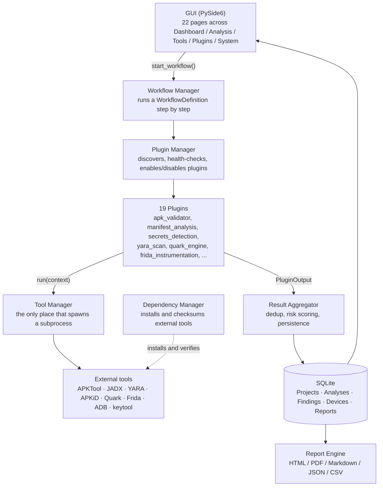

**The GUI never calls a Plugin or a Tool directly** — every action routes through
`WorkflowManager` (for analysis runs) or a small set of controller methods on
`DeviceConnectionManager`/`DependencyManager` (for device and tool actions),
dispatched through a background task runner so nothing blocks the UI thread. This
is enforced by convention throughout the codebase, not just described here.

### Registered workflows

| Workflow | Steps |
|---|---|
| `static_analysis_default` | Validate APK → Certificate Analysis → APKTool Decode → JADX Decompile → Manifest Analysis → Network Security Config → Secrets Detection → Code Analysis → Tracker & SDK Detection *(9 steps)* |
| `malware_analysis_default` | File Hashing → Certificate Analysis → VirusTotal Lookup → YARA Scan → APKiD Scan → Quark-Engine Scan → APKTool Decode → JADX Decompile → Manifest Analysis → IOC Extraction → MITRE ATT&CK Mapping *(11 steps)* |
| `dynamic_analysis_default` | Validate APK → APKTool Decode → Manifest Analysis → App Deployment → Frida Instrumentation → Logcat Capture *(6 steps)* |
| `privacy_analysis_default` | Validate APK → APKTool Decode → Manifest Analysis → Network Security Config → Tracker & SDK Detection → IOC Extraction *(6 steps)* |
| `reverse_engineering_default` | Validate APK → APKTool Decode → JADX Decompile *(3 steps — decode/decompile only, no findings-producing steps; this one exists to populate the project workspace for manual review)* |

Every step except the first validation step is `required=False` — a missing
optional tool degrades the pipeline gracefully (the step is recorded as
`SKIPPED`, with a reason, visible in the pipeline view before you even run it)
rather than aborting the whole analysis.

---

## Installation

```bash
git clone <this-repo>
cd Pentroid
pip install -r requirements.txt --break-system-packages   # or use a venv
python main.py
```

External tools (APKTool, JADX, YARA, Frida, ...) are **not** bundled — install them
from **Toolbox** or **Dependency Manager** inside the app on first run. Every
pipeline page shows exactly which of its steps are backed by an installed tool
before you click Run.

Run the test suite:
```bash
pytest tests/ -v
```
GUI tests run headless automatically (`QT_QPA_PLATFORM=offscreen`, set in
`tests/conftest.py`). 396 of 400 tests pass in a stock environment; the remaining 4
need `yara-python` installed (`pip install yara-python`) to exercise real YARA
matching rather than being skipped.

---

## Usage

**1. Create a project and pick a workflow.** Every analysis page (Android APK,
Android Malware, Dynamic Analysis, Privacy Analysis, Static Analysis, Reverse
Engineering) shows its pipeline *before* you run it — which plugin backs each
step, and whether the tool it needs is currently installed:

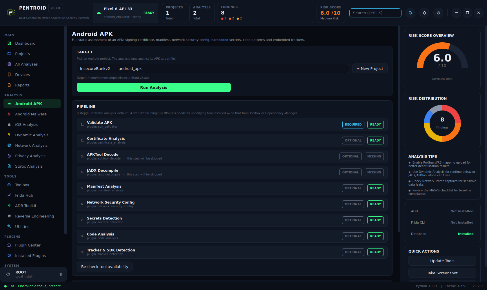

**2. Run it.** Progress streams live; a step whose tool isn't installed is skipped
with a visible reason instead of silently producing an incomplete, unexplained
report.

**3. Triage the findings.** Grouped by severity, each with its evidence, OWASP/MASVS
mapping, and a recommendation — and a status you can actually set and have it stick:

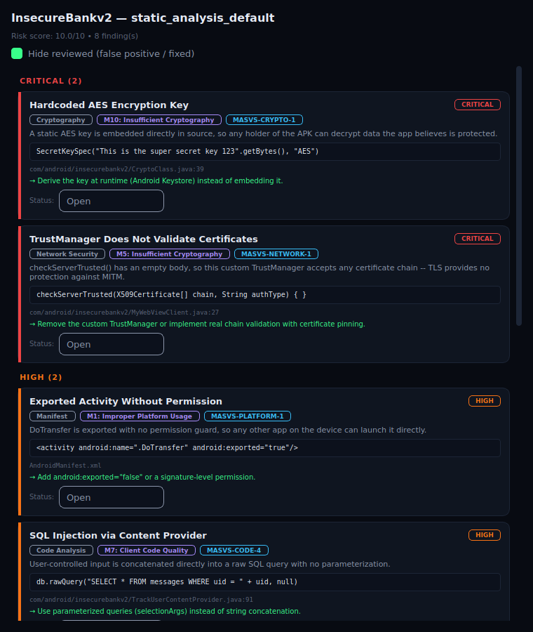

**4. Reports.** When an analysis is run from the **Projects** page (its own
"Run Static Analysis" button), an HTML report is generated automatically and
appears on the **Reports** page, where you can open or delete it. `ReportEngine`
itself supports PDF, Markdown, JSON, and CSV too (see [Example Output](#example-output)
below for a real JSON sample) — there just isn't a format picker wired into the
GUI yet, and analyses run from the dedicated **Analysis** section pages (Android
APK, Static Analysis, etc.) don't trigger report generation at all yet. Both are
tracked in the [Roadmap](#roadmap).

### Keyboard shortcuts

| Shortcut | Action |
|---|---|
| `Ctrl+K` | Focus the search field (top bar) |
| `Enter` (in search field) | Run a search across projects, analyses, and findings by name |
| `Esc` (in any dialog) | Close the dialog without saving unsaved changes |

There's no shortcut palette beyond this yet — search and dialog dismissal are the
two Pentroid binds itself; everything else is standard Qt (`Tab` to move between
fields, `Enter` to trigger the focused button, etc.).

### Page-by-page guide

Every sidebar destination is a real, working page — grouped here the same way the
sidebar groups them.

**MAIN**
- **Dashboard** — portfolio overview: risk gauge, findings-by-severity/category,
  recent projects/analyses/devices/reports, a live tail of the app's own log file,
  and Quick Actions (update all tools, take a screenshot, clear cache).
- **Projects** — create/list projects; each project's **Run Static Analysis**
  button is currently the *only* action in the GUI that auto-generates a report
  (HTML) when the run completes — see the note in [Usage](#usage) above.
- **All Analyses** — every analysis ever run, across every project, in one list.
- **Devices** — **Scan for Devices** (header button) to discover connected
  ADB devices/emulators; **Run Setup Wizard** per device walks through getting it
  ready (root check, Frida server, proxy) in one guided flow instead of visiting
  Frida Hub/Network Analysis separately.
- **Reports** — open or delete a report that's already been generated; it doesn't
  generate new ones (see above).

**ANALYSIS** — Android APK, Android Malware, iOS Analysis, Dynamic Analysis,
Network Analysis, Privacy Analysis, Static Analysis, Reverse Engineering. Each of
the seven Android/cross-platform ones shows its pipeline before you run it (see the
[Registered workflows](#registered-workflows) table for exactly which steps each
one runs) — pick a project, hit **Run Analysis**, and the last run's result stays
visible on the same page. iOS Analysis and Network Analysis state plainly what
isn't backed by a real workflow yet rather than presenting a button that would
silently do nothing.

**TOOLS**
- **Toolbox** — every external tool Pentroid can drive, grouped by purpose
  (Decompile & Unpack, Malware Triage, Device & Runtime, Network). One-click
  **Install** per tool; **Refresh status** re-checks what's actually on disk.
- **Frida Hub** — install the Frida CLI/`frida-server` builds, then **Start**/
  **Stop**/**Check status** the server on a selected device.
- **ADB Toolkit** — device properties (`getprop`), list/launch/force-stop/
  uninstall third-party packages, install an APK — all through one device picker.
- **Reverse Engineering** — decode/decompile an APK (APKTool + JADX) into the
  project's workspace folder for manual reading; produces no findings by design.
- **Utilities** — a file hash calculator (MD5/SHA-1/SHA-256), where Pentroid
  stores things on disk, and live database row counts.

**PLUGINS**
- **Plugin Center** — all 19 plugins with live health (READY / TOOL MISSING) and
  a per-plugin enable/disable toggle.
- **Installed Plugins** — the same catalog from an operator's angle: which
  workflow(s) each plugin is actually wired into, so you can see if one you
  enabled is genuinely used anywhere.

**SYSTEM**
- **Dependency Manager** — the same tools as Toolbox, grouped by *how* they
  install (GitHub release / PyPI virtualenv / vendor download / system PATH /
  external service) instead of by purpose.
- **Settings** — service API keys (VirusTotal/MobSF/Burp) — stored in plaintext
  in the local database today, stated directly in the UI, not hidden in a footnote.
- **Logs** — the live application log, with level filter, text search, and
  adjustable tail length; not a static file dump.

---

## Example Workflow

Running `static_analysis_default` against **InsecureBankv2** (a well-known,
intentionally-vulnerable Android test app used throughout this README as a safe,
realistic demo target — not a real product) surfaces, among other things:

> **TrustManager Does Not Validate Certificates** — `CRITICAL`
> `checkServerTrusted()` has an empty body in `MyWebViewClient.java:27`, so this
> custom TrustManager accepts any certificate chain. TLS provides no protection
> against a MITM attacker.
> → *Remove the custom TrustManager or implement real chain validation with
> certificate pinning.*

That single finding, on its own, is enough to dominate the app's risk score under
Pentroid's scoring model (see [Key Features](#key-features)) — a researcher
scanning the findings list top-to-bottom sees it first, not buried under an average
pulled down by seven lower-severity notes.

---

## Example Output

A real, unedited excerpt of Pentroid's own JSON export (`ReportFormat.JSON`) for
the run above — the same data structure every plugin's findings flow into:

```json
{
  "project": {
    "name": "InsecureBankv2",
    "platform": "android",
    "project_type": "android_apk",
    "target_path": "/home/demo/samples/InsecureBankv2.apk"
  },
  "analysis": {
    "workflow_name": "static_analysis_default",
    "status": "completed",
    "risk_score": 10.0
  },
  "findings": [
    {
      "title": "Hardcoded AES Encryption Key",
      "severity": "critical",
      "category": "Cryptography",
      "owasp_mapping": "M10: Insufficient Cryptography",
      "masvs_mapping": "MASVS-CRYPTO-1",
      "evidence": "SecretKeySpec(\"This is the super secret key 123\".getBytes(), \"AES\")",
      "file_path": "com/android/insecurebankv2/CryptoClass.java",
      "line_number": 39,
      "recommendation": "Derive the key at runtime (Android Keystore) instead of embedding it.",
      "status": "open"
    }
  ],
  "finding_count": 8,
  "severity_counts": {"critical": 2, "high": 2, "medium": 2, "low": 1, "info": 1}
}
```

HTML, PDF, and Markdown exports render the same underlying data as a formatted
report; CSV flattens it one row per finding.

---

## Screenshot Gallery

| | |
|---|---|
|  **Dashboard** — live risk gauge, severity breakdown, recent projects/analyses, live log tail | 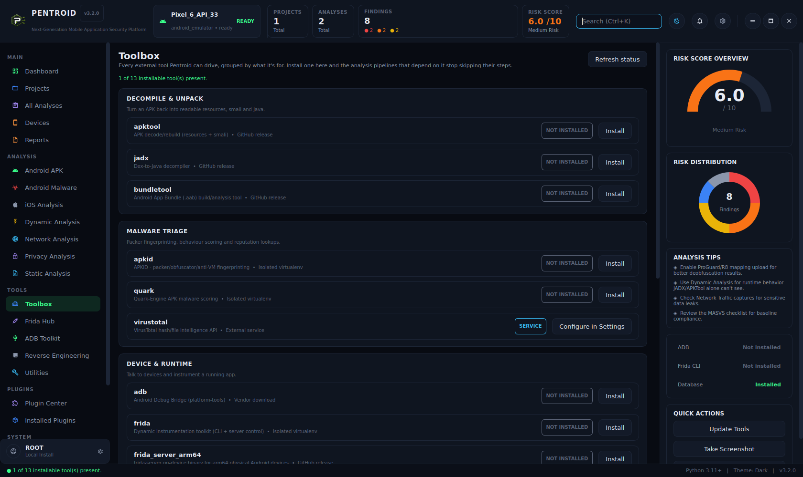 **Toolbox** — every external tool, grouped by purpose, with real one-click install |
| 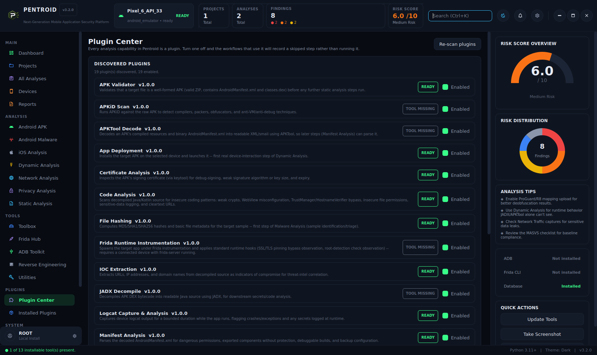 **Plugin Center** — all 19 plugins, live health per plugin, enable/disable | 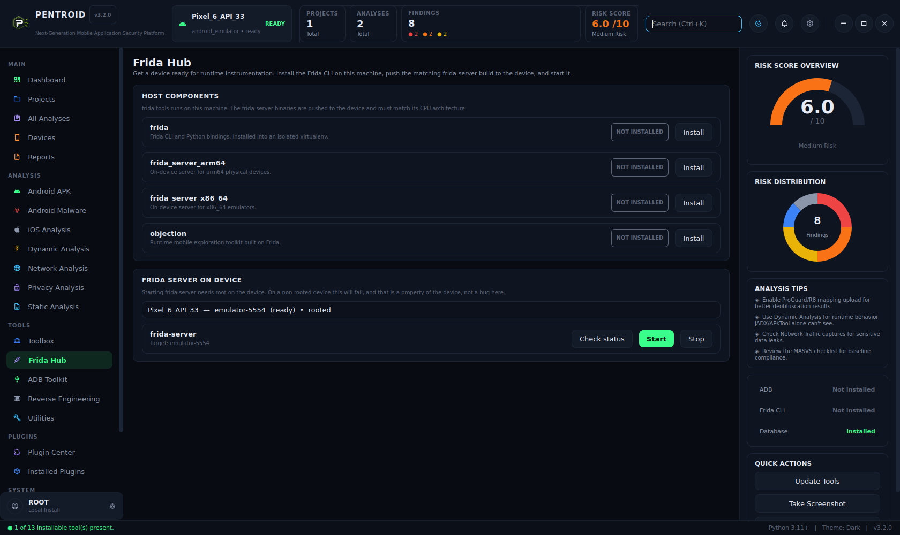 **Frida Hub** — install, push `frida-server`, start/stop, live device readiness |
| 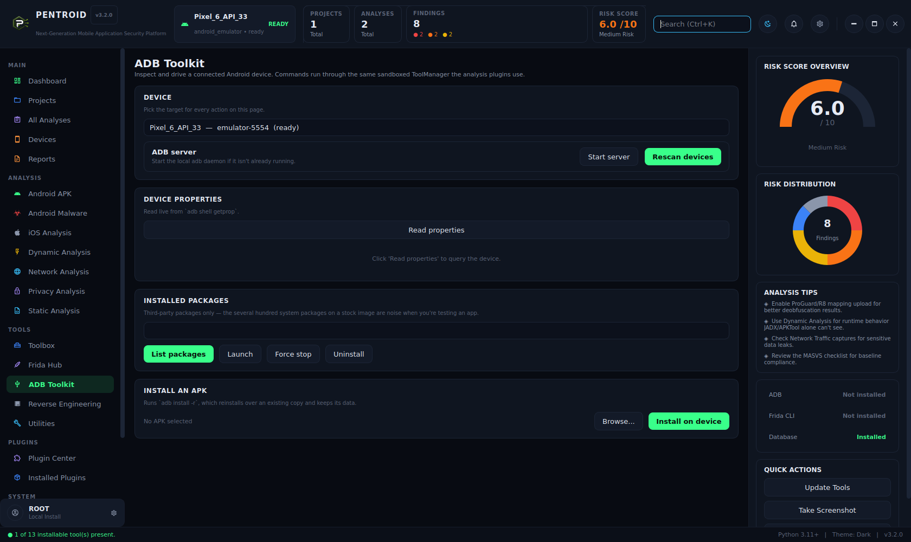 **ADB Toolkit** — device properties, package management, APK install | 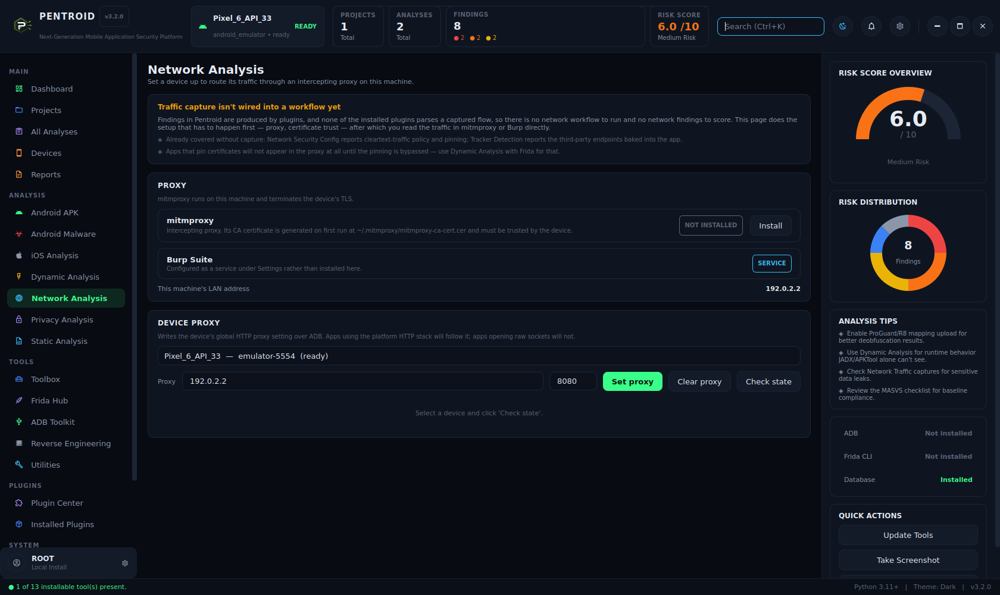 **Network Analysis** — proxy/cert setup, with an honest capability boundary |
| 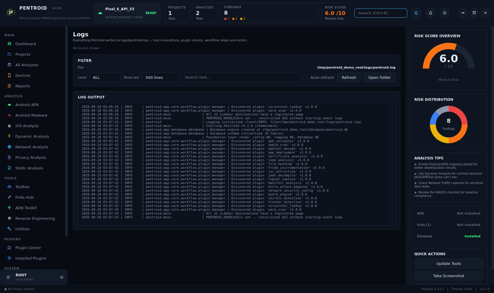 **Logs** — live-filterable application log, not a static file dump |  **Findings** — grouped by severity, with persistent per-finding triage |

---

## What's Genuinely Verified vs. What Needs a Sanity Check

This project is built with a hard rule: verify against the real thing wherever
possible, and say clearly when that wasn't possible.

### Verified for real
- JADX, APKTool, Bundletool, frida-tools, Objection, Quark-Engine, APKiD,
  pymobiledevice3 — genuinely downloaded and executed (GitHub releases + PyPI, both
  live), each checksum-verified on install.
- `keytool`-based certificate analysis, tested against real signed test APKs
  (debug/release/expired/weak-crypto), plus real binary parsing of Android's
  documented APK Signing Block v2/v3 format — verified by extracting a real 639-byte
  DER certificate from a genuine, complex production APK, not just synthetic data.
- YARA rules — compiled and matched with real `yara-python`, including "N of M"
  threshold conditions.
- MITRE ATT&CK technique IDs — every one confirmed via a live fetch of
  `attack.mitre.org`; anything unconfirmable was left unmapped rather than guessed.
- The full GUI navigation surface — all 22 sidebar destinations construct a real
  page backed by live data; this is asserted by an automated test
  (`test_every_sidebar_destination_has_a_page_class`), not just claimed here.
- The risk-scoring formula, dedup key, and two TLS-bypass detection rules were
  reviewed, found to have concrete correctness bugs, fixed, and regression-tested
  (see `tests/test_result_aggregator.py`, `tests/test_code_analysis_rules.py`).

### Needs your own sanity check
- **VirusTotal integration** — built against VT's documented API v3 schema; run a
  real lookup against your own key before trusting it operationally.
- **Frida runtime instrumentation** — the hook script uses standard, published
  OWASP MASTG technique (SSL-pinning bypass, root-detection observation) but should
  be validated against a real running app on your own device before relying on it.
- **iOS device management** — no macOS/iOS hardware in this project's development
  environment; `pymobiledevice3`'s CLI/JSON parsing is defensive, not confirmed
  against live output. The iOS Analysis page states this in-app rather than hiding
  it behind a button that would silently do nothing.

### Known limitations, stated plainly
- API keys (VirusTotal/MobSF/Burp) are stored in **plaintext** in the local SQLite
  database — no OS-keychain layer yet. Settings says this directly.
- No iOS analysis *workflow* exists yet (only the device-connection layer) — see
  the in-app Network/iOS pages for exactly what is and isn't built.
- No network traffic *capture* plugin exists yet — proxy/certificate setup is real,
  but there's no workflow step that parses a captured flow into findings.

---

## Roadmap

- [x] All 22 sidebar destinations backed by real, working pages
- [x] Confidence-and-dominance-aware risk scoring (a single CRITICAL no longer gets
      averaged away by low-value findings)
- [x] Per-finding triage (Confirmed / False Positive / Fixed / Accepted Risk),
      persisted and filterable
- [x] Real global search across projects, analyses, and findings
- [ ] Finding fingerprinting for true cross-location, cross-scan deduplication
      (current dedup catches exact same-location duplicates; a secret found via
      both APKTool's and JADX's output still reports twice)
- [ ] Cross-plugin correlation — e.g. an analytics SDK plus cleartext traffic
      allowed for its domain becoming one synthesized higher-severity finding
      instead of two unrelated low-severity ones
- [ ] Report generation reachable from every Analysis page, with a format picker
      (today only Projects page's quick-run auto-generates a report, HTML only —
      found while writing this README's own usage instructions)
- [ ] Native library (`.so`) scanning — currently a total blind spot
- [ ] A CLI wrapper around the existing synchronous workflow entry point, for CI use
- [ ] A one-click Frida script library (SSL-pinning bypass, root-detection bypass,
      crypto tracer) launched straight from Frida Hub
- [ ] Network traffic capture as an actual findings-producing workflow step
- [ ] iOS static analysis workflow (device layer already exists)

---

## Contributing

Pentroid's plugin system is intentionally simple: every plugin is one directory
under `app/plugins/installed/<plugin_id>/` containing a `manifest.json` (metadata —
name, version, description, entry point, whether it needs a device) and a
`plugin.py` subclassing `app.plugins.base.Plugin` with a `run(context)` method.
`PluginManager` auto-discovers it at startup; add it to a `WorkflowStepDefinition`
in `app/core/workflow/workflow_manager.py` to wire it into a pipeline.

To add a new external tool: register it in `TOOL_REGISTRY`
(`app/core/dependency_manager.py`) with the right `InstallMethod`
(`GITHUB_RELEASE`, `PIP_VENV`, `DIRECT_URL`, `SYSTEM`, or `SERVICE`).

Test isolation pattern for anything touching the database: override
`PENTROID_PATHS__ROOT` to a pytest `tmp_path` and reset the module-level
singletons (`get_settings.cache_clear()`, `_engine = None`, `reset_plugin_manager()`)
in an autouse fixture — copy the pattern from any file under `tests/`.

**Module map, for orientation:**
- `app/core/config.py`, `logger.py`, `exceptions.py` — foundation
- `app/database/` — SQLAlchemy models (Projects, Analyses, Devices, Reports,
  Findings, Plugins, Logs, Settings) + session management
- `app/core/dependency_manager.py` — downloads/tracks external tools
- `app/core/tool_manager.py` — the *only* place that spawns a subprocess;
  enforces timeouts, no shell injection
- `app/core/workflow/` — Workflow Manager, Plugin Manager, Task Scheduler,
  Job Monitor, Event Bus, Result Aggregator
- `app/core/device/` — ADB-based Android device management + iOS
  (`pymobiledevice3`-based; see the Known Limitations above)
- `app/plugins/installed/` — 19 plugins, one directory each
- `app/core/report_engine.py` — HTML/PDF/Markdown/JSON/CSV report generation
- `app/gui/pages/` — all 22 sidebar destinations; `app/gui/dialogs/`,
  `app/gui/widgets/` — reusable dialogs and widgets

Issues and PRs welcome.

---

## License

Not yet chosen — add a `LICENSE` file before treating this as open for reuse.

---

## Device connectivity

**Android (ADB)** — USB + wireless. Wireless covers both flows explicitly, since
they differ and are a common failure point:

- *Android 11+*: `adb pair <ip>:<pairing-port> <code>` using the pairing port and
  6-digit code from Developer options > Wireless debugging, **then** `adb connect`
  on a *different* port. The Devices page > "Connect Wirelessly" dialog walks
  through both steps rather than presenting one box that silently fails.
- *Pre-Android 11*: `adb tcpip 5555` over USB first, then connect directly.

Also: device scan/classification (USB, emulator, Genymotion, Waydroid), RSA
authorization, root check, frida-server push/start, CA-certificate check, proxy
get/set/clear, package listing, app install/launch/uninstall.

**iOS (pymobiledevice3)** — brought to rough parity with the Android side:

| Capability | Android | iOS |
|---|---|---|
| Device discovery | `adb devices` | `usbmux list` |
| Authorize/trust | RSA prompt | `lockdown pair` |
| List apps | `pm list packages` | `apps list` |
| Install app | `adb install` | `apps install` |
| Uninstall app | `adb uninstall` | `apps uninstall` |
| MITM CA check | user cacerts dir | `profile list` |
| Install CA | manual | `profile install` |
| Readiness aggregate | `DeviceReadiness` | `IOSDeviceReadiness` |
| Platform prerequisite | root | **Developer Mode** (iOS 16+) |

Developer Mode has no Android equivalent and blocks *all* developer tooling
(including Frida attach) on iOS 16+ until enabled on-device, so it's surfaced
explicitly (`amfi developer-mode-status`) rather than letting later steps fail
with a confusing error. A failed status query returns `None` ("unknown"), never
`False` ("confirmed disabled").

**Verification status:** pymobiledevice3 subcommand *names and syntax* were
verified against a real `--help` run of the installed package. The exact stdout
*shape* of each command was not observable without iOS hardware, so every parser
accepts multiple plausible shapes (JSON list, JSON dict, plain lines) and returns
empty/`None` rather than raising. Sanity-check against a real device before
depending on these.

---

## Reporting & tool integration

### Finding data model

Findings capture the fields a professional assessment report actually needs,
not just a title and severity:

`impact` · `reproduction_steps` · `affected_components` · `evidence` ·
`cwe_id` · `cvss_vector` · `cvss_score` · `confidence` · `references` ·
`recommendation` · OWASP / MASVS / MITRE mappings

**Confidence is tracked separately from severity.** Severity is *how bad if
real*; confidence is *how sure we are it's real*. An entropy-matched "possible
secret" and a parsed `android:debuggable="true"` are both reported, but not as
the same strength of claim — which is what makes triage practical instead of
wading through undifferentiated output.

### Knowledge base (`app/core/knowledge/finding_kb.py`)

Plugins emit a stable `finding_key`; the Result Aggregator enriches from a
central knowledge base at persistence time. This replaced per-plugin hardcoded
recommendation strings, which had capped report quality at whatever each plugin
author typed and meant improving guidance required editing 19 files.

Plugin-supplied values always override the knowledge base — it sets a quality
floor without taking away plugin control.

CVSS vectors in the KB are **base-score estimates for the generic case** of each
issue class, intended as a triage starting point, not a substitute for scoring
the specific instance in its deployment context.

### Output formats

| Format | Purpose |
|---|---|
| **HTML** | Full assessment report: executive summary, severity distribution, findings summary table, then per-finding impact / affected components / evidence / reproduction steps / CVSS vector / remediation / references. Print stylesheet included. |
| **SARIF 2.1.0** | Tool interoperability — **validated against the official OASIS schema** |
| PDF | Portable report via ReportLab |
| Markdown | Plain-text / wiki embedding |
| JSON / CSV | Raw data for custom pipelines |

A completed analysis auto-generates **HTML + SARIF**, so a run is immediately
useful both to a human reader and to a pipeline.

### SARIF integration

SARIF is the format static-analysis tooling has standardised on, so emitting it
plugs Pentroid into existing infrastructure rather than requiring anyone to
parse a bespoke JSON shape:

- **GitHub Advanced Security / code scanning** — upload turns a Pentroid run into
  inline PR annotations
- **DefectDojo, Azure DevOps, GitLab, VS Code (SARIF Viewer)**

Implementation notes:
- Each `finding_key` becomes a SARIF **rule**; findings become **results**
  referencing it — that's what lets consumers group, suppress, and trend
  findings instead of seeing unrelated one-offs.
- SARIF's `level` has only 4 values vs our 5 severities, so the mapping is
  lossy by design — the precise severity, confidence, CVSS score and vector are
  preserved in `properties` for consumers that look deeper.
- `security-severity` uses the real CVSS score when available (GitHub buckets
  alerts by it), falling back to a per-severity default otherwise.
- CWE IDs are emitted as `external/cwe/cwe-NNN` tags, the convention GitHub
  recognises for CWE linking.
- A `region.startLine` is only emitted when a real line number exists — a
  default of 1 would point reviewers at the wrong code.

### Database migration

`Base.metadata.create_all()` creates missing *tables* but never adds missing
*columns*, so upgrading with an existing `pentroid.db` would otherwise fail with
"no such column". `_migrate_schema()` performs additive `ALTER TABLE ... ADD
COLUMN` for the new reporting fields, is idempotent, and is regression-tested
against a real old-schema database with pre-existing rows.

Deliberately not Alembic: additive-only history in a single-file desktop app
doesn't justify a migration framework. A future destructive change is the point
to reach for one.
